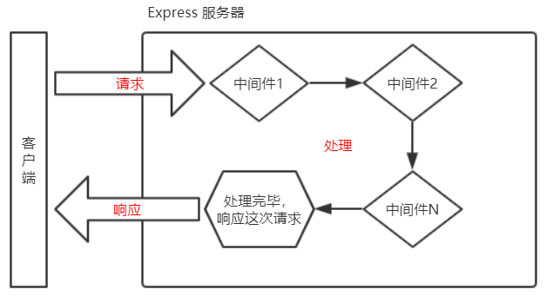

# 什么是 Express
官方给出的概念：Express 是基于 Node.js 平台，快速、开放、极简的 Web 开发框架。
通俗的理解：Express 的作用和 Node.js 内置的 http 模块类似，是专门用来创建 Web 服务器的。
**Express 的本质**：就是一个 npm 上的第三方包，提供了快速创建 Web 服务器的便捷方法。

## Express 能做什么

对于前端程序员来说，最常见的两种服务器，分别是：
- Web 网站服务器：专门对外提供 Web 网页资源的服务器。
- API 接口服务器：专门对外提供 API 接口的服务器。
使用 Express，我们可以方便、快速的创建 Web 网站的服务器或 API 接口的服务器。

## 基本使用
```javascript
// 1. 导入 express
const express = require('express')

// 2. 创建 web 服务器
const app = express()

// 4. 监听客户端的 GET 和 POST 请求，并向客户端响应具体的内容
app.get('/user', (req, res) => {
  // 调用 express 提供的 res.send() 方法，向客户端响应一个 JSON 对象
  res.send({ name: 'zs', age: 20, gender: '男' })
})
app.post('/user', (req, res) => {
  // 调用 express 提供的 res.send() 方法，向客户端响应一个 文本字符串
  res.send('请求成功')
})
app.get('/', (req, res) => {
  // 通过 req.query 可以获取到客户端发送过来的 查询参数
  // 注意：默认情况下，req.query 是一个空对象
  console.log(req.query)
  res.send(req.query)
})
// 注意：这里的 :id 是一个动态的参数
app.get('/user/:ids/:username', (req, res) => {
  // req.params 是动态匹配到的 URL 参数，默认也是一个空对象
  console.log(req.params)
  res.send(req.params)
})

// 3. 启动 web 服务器
app.listen(80, () => {
  console.log('express server running at http://127.0.0.1')
})

```

## 静态资源

```javascript
const express = require('express')
const app = express()

// 在这里，调用 express.static() 方法，快速的对外提供静态资源
app.use('/files', express.static('./files'))
app.use(express.static('./clock'))

app.listen(80, () => {
  console.log('express server running at http://127.0.0.1')
})

```

# 路由
## Express 中的路由
在 Express 中，路由指的是客户端的请求与服务器处理函数之间的映射关系。
Express 中的路由分 3 部分组成，分别是请求的类型、请求的 URL 地址、处理函数，格式如下：
```javascript
app.METHOD(PATH, HANDLER)
```
**路由的匹配过程**
每当一个请求到达服务器之后，需要先经过路由的匹配，只有匹配成功之后，才会调用对应的处理函数。
在匹配时，会按照路由的顺序进行匹配，如果请求类型和请求的 URL 同时匹配成功，则 Express 会将这次请求，转交给对应的 function 函数进行处理

## 最简单的路由用法
```javascript
const express = require('express')
const app = express()

// 挂载路由
app.get('/', (req, res) => {
  res.send('hello world.')
})
app.post('/', (req, res) => {
  res.send('Post Request.')
})

app.listen(80, () => {
  console.log('http://127.0.0.1')
})

```

## 模块化路由
为了方便对路由进行模块化的管理，Express 不建议将路由直接挂载到 app 上，而是推荐将路由抽离为单独的模块。

将路由抽离为单独模块的步骤如下：
1. 创建路由模块对应的 .js 文件
2. 调用 **express.Router()** 函数创建路由对象
3. 向路由对象上挂载具体的路由
4. 使用 **module.exports** 向外共享路由对象
5. 使用 **app.use()** 函数注册路由模块

创建模块
```javascript
// 这是路由模块
// 1. 导入 express
const express = require('express')
// 2. 创建路由对象
const router = express.Router()

// 3. 挂载具体的路由
router.get('/user/list', (req, res) => {
  res.send('Get user list.')
})
router.post('/user/add', (req, res) => {
  res.send('Add new user.')
})

// 4. 向外导出路由对象
module.exports = router
```

使用模块
```javascript
const express = require('express')
const app = express()

// app.use('/files', express.static('./files'))

// 1. 导入路由模块
const router = require('./03.router')
// 2. 注册路由模块
app.use('/api', router)

// 注意： app.use() 函数的作用，就是来注册全局中间件

app.listen(80, () => {
  console.log('http://127.0.0.1')
})
```

## Express 中间件
###  Express 中间件的调用流程
当一个请求到达 Express 的服务器之后，可以连续调用多个中间件，从而对这次请求进行预处理


## Express 中间件的初体验
```javascript
const express = require('express')
const app = express()

// // 定义一个最简单的中间件函数
const mw = function (req, res, next) {
  console.log('这是最简单的中间件函数')
  // 把流转关系，转交给下一个中间件或路由
  next()
}

// // 将 mw 注册为全局生效的中间件
app.use(mw)

// 这是定义全局中间件的简化形式
app.use((req, res, next) => {
  console.log('这是最简单的中间件函数')
  next()
})

app.get('/', (req, res) => {
  console.log('调用了 / 这个路由')
  res.send('Home page.')
})
app.get('/user', (req, res) => {
  console.log('调用了 /user 这个路由')
  res.send('User page.')
})

app.listen(80, () => {
  console.log('http://127.0.0.1')
})
```

## Express 使用
```javascript
const express = require('express')
const app = express()

// 这是定义全局中间件的简化形式
app.use((req, res, next) => {
  // 获取到请求到达服务器的时间
  const time = Date.now()
  // 为 req 对象，挂载自定义属性，从而把时间共享给后面的所有路由
  req.startTime = time
  next()
})

app.get('/', (req, res) => {
  res.send('Home page.' + req.startTime)
})
app.get('/user', (req, res) => {
  res.send('User page.' + req.startTime)
})

app.listen(80, () => {
  console.log('http://127.0.0.1')
})

```

## 局部生效的中间件
```javascript
// 导入 express 模块
const express = require('express')
// 创建 express 的服务器实例
const app = express()

// 1. 定义中间件函数
const mw1 = (req, res, next) => {
  console.log('调用了局部生效的中间件')
  next()
}

// 单个局部中间件
app.get('/', mw1, (req, res) => {
  res.send('Home page.')
})
app.get('/user', (req, res) => {
  res.send('User page.')
})

// 多个局部中间件
app.get('/', [mw1, mw2], (req, res) => {
  res.send('Home page.')
})
app.get('/user', (req, res) => {
  res.send('User page.')
})

// 调用 app.listen 方法，指定端口号并启动web服务器
app.listen(80, function () {
  console.log('Express server running at http://127.0.0.1')
})
```
## 中间件的分类
为了方便大家理解和记忆中间件的使用，Express 官方把常见的中间件用法，分成了 5 大类，分别是：
1. 应用级别的中间件
2. 路由级别的中间件
    ```javascript
    var app = express()
    var router = express.Router()

    router.use(function (req, res, next){
        console.log('Time:', Date.now())
        next()
    })

    app.use('/', router)
    ```
4. 错误级别的中间件
    错误级别中间件的作用：专门用来捕获整个项目中发生的异常错误，从而防止项目异常崩溃的问题。
    格式：错误级别中间件的 function 处理函数中，必须有 4 个形参，形参顺序从前到后，分别是 (err, req, res, next)。
    ```javascript
    // 导入 express 模块
    const express = require('express')
    // 创建 express 的服务器实例
    const app = express()

    // 1. 定义路由
    app.get('/', (req, res) => {
    // 1.1 人为的制造错误
    throw new Error('服务器内部发生了错误！')
    res.send('Home page.')
    })

    // 2. 定义错误级别的中间件，捕获整个项目的异常错误，从而防止程序的崩溃
    app.use((err, req, res, next) => {
    console.log('发生了错误！' + err.message)
    res.send('Error：' + err.message)
    })

    // 调用 app.listen 方法，指定端口号并启动web服务器
    app.listen(80, function () {
    console.log('Express server running at http://127.0.0.1')
    })
    ```
    **注意：错误级别的中间件，必须注册在所有路由之后！**
5. Express 内置的中间件
    自 Express 4.16.0 版本开始，Express 内置了 3 个常用的中间件，极大的提高了 Express 项目的开发效率和体验：
    - express.static 快速托管静态资源的内置中间件，例如： HTML 文件、图片、CSS 样式等（无兼容性）
    - express.json 解析 JSON 格式的请求体数据（有兼容性，仅在 4.16.0+ 版本中可用）
    - express.urlencoded 解析 URL-encoded 格式的请求体数据（有兼容性，仅在 4.16.0+ 版本中可用
    ```javascript
        // 导入 express 模块
    const express = require('express')
    // 创建 express 的服务器实例
    const app = express()

    // 注意：除了错误级别的中间件，其他的中间件，必须在路由之前进行配置
    // 通过 express.json() 这个中间件，解析表单中的 JSON 格式的数据
    app.use(express.json())

    // 通过 express.urlencoded() 这个中间件，来解析 表单中的 url-encoded 格式的数据
    app.use(express.urlencoded({ extended: false }))

    app.post('/user', (req, res) => {
    // 在服务器，可以使用 req.body 这个属性，来接收客户端发送过来的请求体数据
    // 默认情况下，如果不配置解析表单数据的中间件，则 req.body 默认等于 undefined
    console.log(req.body)
    res.send('ok')
    })

    app.post('/book', (req, res) => {
    // 在服务器端，可以通过 req,body 来获取 JSON 格式的表单数据和 url-encoded 格式的数据
    console.log(req.body)
    res.send('ok')
    })

    // 调用 app.listen 方法，指定端口号并启动web服务器
    app.listen(80, function () {
    console.log('Express server running at http://127.0.0.1')
    })
    ```
6. 第三方的中间件

## 自定义中间件
 需求描述与实现步骤
自己手动模拟一个类似于 express.urlencoded 这样的中间件，来解析 POST 提交到服务器的表单数据。
实现步骤：
1. 定义中间件
2. 监听 req 的 data 事件
3. 监听 req 的 end 事件
4. 使用 querystring 模块解析请求体数据
5. 将解析出来的数据对象挂载为 req.body
6. 将自定义中间件封装为模块

```javascript
// 导入 express 模块
const express = require('express')
// 创建 express 的服务器实例
const app = express()
// 导入 Node.js 内置的 querystring 模块
const qs = require('querystring')

// 这是解析表单数据的中间件
app.use((req, res, next) => {
  // 定义中间件具体的业务逻辑
  // 1. 定义一个 str 字符串，专门用来存储客户端发送过来的请求体数据
  let str = ''
  // 2. 监听 req 的 data 事件
  req.on('data', (chunk) => {
    str += chunk
  })
  // 3. 监听 req 的 end 事件
  req.on('end', () => {
    // 在 str 中存放的是完整的请求体数据
    // console.log(str)
    // TODO: 把字符串格式的请求体数据，解析成对象格式
    const body = qs.parse(str)
    req.body = body
    next()
  })
})

app.post('/user', (req, res) => {
  res.send(req.body)
})

// 调用 app.listen 方法，指定端口号并启动web服务器
app.listen(80, function () {
  console.log('Express server running at http://127.0.0.1')
})
```
# 使用 Express 写接口
```javascript
// 导入 express
const express = require('express')
// 创建服务器实例
const app = express()

// 配置解析表单数据的中间件
app.use(express.urlencoded({ extended: false }))

// 必须在配置 cors 中间件之前，配置 JSONP 的接口
app.get('/api/jsonp', (req, res) => {
  // TODO: 定义 JSONP 接口具体的实现过程
  // 1. 得到函数的名称
  const funcName = req.query.callback
  // 2. 定义要发送到客户端的数据对象
  const data = { name: 'zs', age: 22 }
  // 3. 拼接出一个函数的调用
  const scriptStr = `${funcName}(${JSON.stringify(data)})`
  // 4. 把拼接的字符串，响应给客户端
  res.send(scriptStr)
})

// 一定要在路由之前，配置 cors 这个中间件，从而解决接口跨域的问题
const cors = require('cors')
app.use(cors())

// 导入路由模块
const router = require('./16.apiRouter')
// 把路由模块，注册到 app 上
app.use('/api', router)

// 启动服务器
app.listen(80, () => {
  console.log('express server running at http://127.0.0.1')
})

```

## 跨域问题
刚才编写的 GET 和 POST接口，存在一个很严重的问题：不支持跨域请求。
解决接口跨域问题的方案主要有两种：
1. CORS（主流的解决方案，推荐使用）
2. JSONP（有缺陷的解决方案：只支持 GET 请求）

### CORS
CORS （Cross-Origin Resource Sharing，跨域资源共享）由一系列 HTTP 响应头组成，**这些 HTTP 响应头决定浏览器是否阻止前端 JS 代码跨域获取资源**。
浏览器的同源安全策略默认会阻止网页“跨域”获取资源。**但如果接口服务器配置了 CORS 相关的 HTTP 响应头，就可以解除浏览器端的跨域访问限制**。

#### 注意事项：
1. CORS 主要在服务器端进行配置。客户端浏览器无须做任何额外的配置，即可请求开启 CORS 的接口。
2. CORS 在浏览器中有兼容性。只有支持 XMLHttpRequest Level2 的浏览器，才能正常访问开启了 CORS 的服
务端接口（例如：IE10+、Chrome4+、FireFox3.5+）

#### Access-Control-Allow-Origin
CORS 响应头部 - Access-Control-Allow-Origin：
响应头部中可以携带一个 Access-Control-Allow-Origin 字段：
```javascript
res.setHeader('Access-Control-Allow-Origin', 'http://itcast.cn')
```

默认情况下，CORS 仅支持客户端向服务器发送如下的 9 个请求头：
Accept、Accept-Language、Content-Language、DPR、Downlink、Save-Data、Viewport-Width、Width 、Content-Type （值仅限于 text/plain、multipart/form-data、application/x-www-form-urlencoded 三者之一）

#### others
如果客户端向服务器发送了额外的请求头信息，则需要在服务器端，通过 Access-Control-Allow-Headers 对额外的请求头进行声明，否则这次请求会失败
```javascript
res.setHeader('Access-Control-Allow-Headers','Content-Type, X-Custom-Header')
```

同理，可以通过 **Access-Control-Allow-Methods** 设置**PUT，DELETE**等方法。

#### CORS请求的分类
简单请求
同时满足以下两大条件的请求，就属于简单请求：
1. 请求方式：GET、POST、HEAD 三者之一
2. HTTP 头部信息不超过以下几种字段：无自定义头部字段、Accept、Accept-Language、Content-Language、DPR、Downlink、Save-Data、Viewport-Width、Width 、Content-Type（只有三个值application/x-www-form-urlencoded、multipart/form-data、text/plain）
   
预检请求
只要符合以下任何一个条件的请求，都需要进行预检请求：
1. 请求方式为 **GET、POST、HEAD 之外**的请求 Method 类型
2. 请求头中**包含自定义头部字段**
3. 向服务器发送了 **application/json** 格式的数据
在浏览器与服务器正式通信之前，浏览器会先发送** OPTION **请求进行预检，以获知服务器是否允许该实际请求，所以这一
次的 OPTION 请求称为“预检请求”。服务器成功响应预检请求后，才会发送真正的请求，并且携带真实数据。

### JSONP 接口
1. JSONP 不属于真正的 Ajax 请求，因为它没有使用 XMLHttpRequest 这个对象。
2. JSONP 仅支持 GET 请求，不支持 POST、PUT、DELETE 等请求。

如果项目中已经配置了 CORS 跨域资源共享，为了防止冲突，必须在配置 CORS 中间件之前声明 JSONP 的接口。**否则JSONP 接口会被处理成开启了 CORS 的接口。**

在网页中使用 jQuery 发起 JSONP 请求:

```javascript
$(function () {
        // 1. 测试GET接口
        $('#btnGET').on('click', function () {
          $.ajax({
            type: 'GET',
            url: 'http://127.0.0.1/api/get',
            data: { name: 'zs', age: 20 },
            success: function (res) {
              console.log(res)
            },
          })
        })
        // 2. 测试POST接口
        $('#btnPOST').on('click', function () {
          $.ajax({
            type: 'POST',
            url: 'http://127.0.0.1/api/post',
            data: { bookname: '水浒传', author: '施耐庵' },
            success: function (res) {
              console.log(res)
            },
          })
        })

        // 3. 为删除按钮绑定点击事件处理函数
        $('#btnDelete').on('click', function () {
          $.ajax({
            type: 'DELETE',
            url: 'http://127.0.0.1/api/delete',
            success: function (res) {
              console.log(res)
            },
          })
        })

        // 4. 为 JSONP 按钮绑定点击事件处理函数
        $('#btnJSONP').on('click', function () {
          $.ajax({
            type: 'GET',
            url: 'http://127.0.0.1/api/jsonp',
            dataType: 'jsonp',
            success: function (res) {
              console.log(res)
            },
          })
        })
      })
```