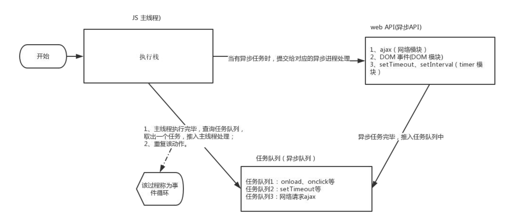

# 事件
## 其他事件

### 页面加载事件

加载外部资源（如图片、外联CSS和JavaScript等）加载完毕时触发的事件

有些时候需要等页面资源全部处理完了做一些事情

**事件名：load**

监听页面所有资源加载完毕：

~~~javascript
window.addEventListener('load', function() {
    // xxxxx
})
~~~

### 元素滚动事件

滚动条在滚动的时候持续触发的事件

~~~javascript
window.addEventListener('scroll', function() {
    // xxxxx
})
~~~

### 页面尺寸事件

会在窗口尺寸改变的时候触发事件：

~~~javascript
window.addEventListener('resize', function() {
    // xxxxx
})
~~~

## 元素尺寸与位置

获取元素的自身宽高、包含元素自身设置的宽高、padding、border

offsetWidth和offsetHeight  

获取出来的是数值,方便计算

注意: 获取的是可视宽高, 如果盒子是隐藏的,获取的结果是0

## 小总结
| 属性  | 作用 |说明|
|----------|----------|--------|
|   scrollLeft和scrollTop |   被卷去的头部和左侧 |配合页面滚动来用，可读写|
|   clientWidth 和 clientHeight |   获得元素宽度和高度 |不包含border,margin，滚动条 用于js获取元素大小，只读属性|
|   offsetWidth和offsetHeight |   获得元素宽度和高度 |包含border、padding，滚动条等，只读|
|   offsetLeft和offsetTop |   获取元素距离自己定位父级元素的左、上距离 |获取元素位置的时候使用，只读属性|

# BOM
## 介绍
- BOM(Browser Object Model ) 是浏览器
  - navigator
  - location
  - document
  - history
  - screen
-  window对象是一个全局对象，也可以说是JavaScript中的顶级对象
-  像document、alert()、console.log()这些都是window的属性，基本BOM的属性和方法都是window的。
-  所有通过var定义在全局作用域中的变量、函数都会变成window对象的属性和方法
-  window对象下的属性和方法调用的时候可以省略window

## 定时器-延迟函数

JavaScript 内置的一个用来让代码延迟执行的函数，叫 setTimeout

**语法：**

~~~JavaScript
setTimeout(回调函数, 延迟时间)
~~~

setTimeout 仅仅只执行一次，所以可以理解为就是把一段代码延迟执行, 平时省略window

间歇函数 setInterval : 每隔一段时间就执行一次， , 平时省略window

清除延时函数：

~~~JavaScript
clearTimeout(timerId)
~~~

>注意点
>
>1. 延时函数需要等待,所以后面的代码先执行
>2. 返回值是一个正整数，表示定时器的编号

~~~html
<body>
  
</body>
~~~

## jS执行机制

## 本地存储

本地存储：将数据存储在本地浏览器中

常见的使用场景：

<https://todomvc.com/examples/vanilla-es6/>    页面刷新数据不丢失

好处：

1、页面刷新或者关闭不丢失数据，实现数据持久化

2、容量较大，sessionStorage和 localStorage 约 5M 左右

###  localStorage（重点）

**作用:** 数据可以长期保留在本地浏览器中，刷新页面和关闭页面，数据也不会丢失

**特性：**以键值对的形式存储，并且存储的是字符串， 省略了window

~~~html
<!DOCTYPE html>
<html lang="en">

<head>
  <meta charset="UTF-8">
  <meta http-equiv="X-UA-Compatible" content="IE=edge">
  <meta name="viewport" content="width=device-width, initial-scale=1.0">
  <title>本地存储-localstorage</title>
</head>

<body>
  
</body>

</html>
~~~

### sessionStorage（了解）

特性：

- 用法跟localStorage基本相同
- 区别是：当页面浏览器被关闭时，存储在 sessionStorage 的数据会被清除

存储：sessionStorage.setItem(key,value)

获取：sessionStorage.getItem(key)

删除：sessionStorage.removeItem(key)

### localStorage 存储复杂数据类型

**问题：**本地只能存储字符串,无法存储复杂数据类型.

**解决：**需要将复杂数据类型转换成 JSON字符串,在存储到本地

**语法：**JSON.stringify(复杂数据类型)

JSON字符串：

- 首先是1个字符串
- 属性名使用双引号引起来，不能单引号
- 属性值如果是字符串型也必须双引号

~~~html
<body>
  
</body>
~~~

**问题：**因为本地存储里面取出来的是字符串，不是对象，无法直接使用

**解决：**把取出来的字符串转换为对象

**语法：**JSON.parse(JSON字符串)

~~~html
<body>
  
</body>
~~~

## 综合案例

### 数组map 方法

**使用场景：**

map 可以遍历数组处理数据，并且返回新的数组

**语法：**

~~~javascript
<body>
  
</body>
~~~

>map 也称为映射。映射是个术语，指两个元素的集之间元素相互“对应”的关系。
>
>map重点在于有返回值，forEach没有返回值（undefined）

### 数组join方法

**作用：**join() 方法用于把数组中的所有元素转换一个字符串

**语法：**

~~~html
<body>
  
</body>
~~~
