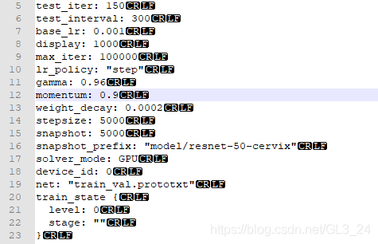

# \r \n \r\n的区别
`\r`、`\n`、`\r\n` 都是表示换行的特殊字符，它们的具体含义和使用方法如下：

- `\r`：意味着回车，将当前光标移到本行的开头而没有换行。在chrome等浏览器中，无法看到其效果。
- `\n`：意味着换行，将当前光标移到下一行的开头。如果你使用Windows操作系统，一般的文本文件的换行都是使用`\r\n`来进行换行的。
- `\r\n`：意味着回车并换行，将当前光标移到下一行的开头，实现了回车和换行两个功能。

在不同操作系统和软件中，换行符的逻辑和表示方式各不相同。
- 在Windows中，则通常使用 `'\r\n'` 作为文本文件的换行符；
- 而在Unix、Linux和OS X等操作系统中，则通常使用 `'\n'` 作为文本文件的换行符。
- 在Macintosh操作系统中，则常使用 `'\r'` 作为文本文件的换行符。
因此，在读写文本文件时，要注意不同操作系统或软件的换行符的差异。

最后再强调一下，`\r`、`\n`、`\r\n` 都是字符串中的特殊字符，需要放在单引号或双引号中才能表示为相应的字符。

# CR LF CRLF
- CR：Carriage Return，对应ASCII中转义字符 **\r**，表示回车
- LF：Linefeed，对应ASCII中转义字符 **\n**，表示换行
- CRLF：Carriage Return & Linefeed，**\r\n**，表示回车并换行
  
这几个玩意是行尾符号，如果打开一个txt
编辑----->档案格式转换---->转换为Windows格式
然后选择菜单栏中的视图---->显示符号---->显示行尾符

